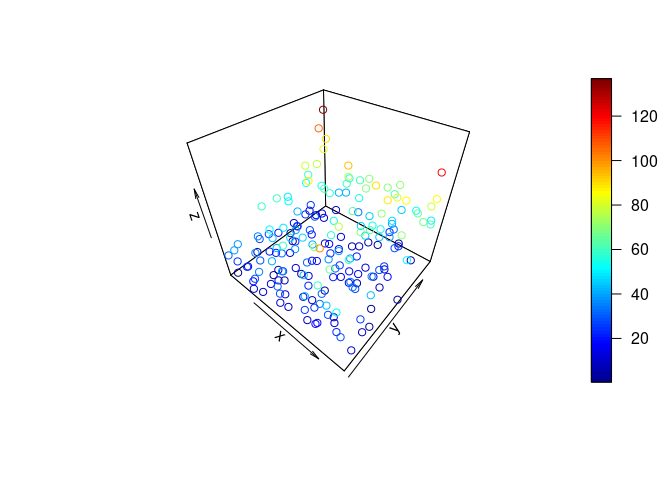

Activity 3 - MLR
================

``` r
library(tidyverse)
```

    ## ── Attaching core tidyverse packages ──────────────────────── tidyverse 2.0.0 ──
    ## ✔ dplyr     1.1.2     ✔ readr     2.1.4
    ## ✔ forcats   1.0.0     ✔ stringr   1.5.0
    ## ✔ ggplot2   3.4.2     ✔ tibble    3.2.1
    ## ✔ lubridate 1.9.2     ✔ tidyr     1.3.0
    ## ✔ purrr     1.0.1     
    ## ── Conflicts ────────────────────────────────────────── tidyverse_conflicts() ──
    ## ✖ dplyr::filter() masks stats::filter()
    ## ✖ dplyr::lag()    masks stats::lag()
    ## ℹ Use the conflicted package (<http://conflicted.r-lib.org/>) to force all conflicts to become errors

``` r
library(tidyr)
library(tidymodels)
```

    ## ── Attaching packages ────────────────────────────────────── tidymodels 1.1.0 ──
    ## ✔ broom        1.0.4     ✔ rsample      1.1.1
    ## ✔ dials        1.2.0     ✔ tune         1.1.1
    ## ✔ infer        1.0.4     ✔ workflows    1.1.3
    ## ✔ modeldata    1.1.0     ✔ workflowsets 1.0.1
    ## ✔ parsnip      1.1.0     ✔ yardstick    1.2.0
    ## ✔ recipes      1.0.6     
    ## ── Conflicts ───────────────────────────────────────── tidymodels_conflicts() ──
    ## ✖ scales::discard() masks purrr::discard()
    ## ✖ dplyr::filter()   masks stats::filter()
    ## ✖ recipes::fixed()  masks stringr::fixed()
    ## ✖ dplyr::lag()      masks stats::lag()
    ## ✖ yardstick::spec() masks readr::spec()
    ## ✖ recipes::step()   masks stats::step()
    ## • Use suppressPackageStartupMessages() to eliminate package startup messages

``` r
library(GGally)
```

    ## Registered S3 method overwritten by 'GGally':
    ##   method from   
    ##   +.gg   ggplot2

``` r
library(datarium)
library(dplyr)
library(plot3D)
```

    ## Warning in fun(libname, pkgname): couldn't connect to display ":0"

``` r
head(marketing)
```

    ##   youtube facebook newspaper sales
    ## 1  276.12    45.36     83.04 26.52
    ## 2   53.40    47.16     54.12 12.48
    ## 3   20.64    55.08     83.16 11.16
    ## 4  181.80    49.56     70.20 22.20
    ## 5  216.96    12.96     70.08 15.48
    ## 6   10.44    58.68     90.00  8.64

``` r
library(dplyr)
library(GGally)

marketing %>%
  select(sales, youtube, facebook, newspaper) %>%
  GGally::ggpairs()
```

<!-- -->

``` r
lm_spec <- linear_reg() %>%
set_mode("regression") %>%
set_engine("lm")

lm_spec
```

    ## Linear Regression Model Specification (regression)
    ## 
    ## Computational engine: lm

``` r
mlr_mod <- lm_spec %>% 
fit(sales ~ youtube + facebook + newspaper, data = marketing)

tidy(mlr_mod)
```

    ## # A tibble: 4 × 5
    ##   term        estimate std.error statistic  p.value
    ##   <chr>          <dbl>     <dbl>     <dbl>    <dbl>
    ## 1 (Intercept)  3.53      0.374       9.42  1.27e-17
    ## 2 youtube      0.0458    0.00139    32.8   1.51e-81
    ## 3 facebook     0.189     0.00861    21.9   1.51e-54
    ## 4 newspaper   -0.00104   0.00587    -0.177 8.60e- 1

``` r
# 3D scatter plot
plot3D::scatter3D(marketing$youtube,marketing$facebook,marketing$newspaper)
```

<!-- -->

``` r
# A pairwise scatterplot matrix
marketing %>%
  select(sales, youtube, facebook, newspaper) %>%
  ggpairs()
```

<!-- -->

``` r
#fit the mlr model
lm_spec <- linear_reg() %>%
     set_mode("regression") %>%
     set_engine("lm")
 
mlr_mod <- lm_spec %>% fit(sales ~ youtube + facebook + newspaper,data=marketing)
 
tidy(mlr_mod)
```

    ## # A tibble: 4 × 5
    ##   term        estimate std.error statistic  p.value
    ##   <chr>          <dbl>     <dbl>     <dbl>    <dbl>
    ## 1 (Intercept)  3.53      0.374       9.42  1.27e-17
    ## 2 youtube      0.0458    0.00139    32.8   1.51e-81
    ## 3 facebook     0.189     0.00861    21.9   1.51e-54
    ## 4 newspaper   -0.00104   0.00587    -0.177 8.60e- 1

``` r
#fit the mlr model
lm_spec <- linear_reg() %>%
set_mode("regression") %>%
set_engine("lm")

int_mod <- lm_spec %>% 
fit(sales ~ youtube + facebook + newspaper,data=marketing)

tidy(int_mod)
```

    ## # A tibble: 4 × 5
    ##   term        estimate std.error statistic  p.value
    ##   <chr>          <dbl>     <dbl>     <dbl>    <dbl>
    ## 1 (Intercept)  3.53      0.374       9.42  1.27e-17
    ## 2 youtube      0.0458    0.00139    32.8   1.51e-81
    ## 3 facebook     0.189     0.00861    21.9   1.51e-54
    ## 4 newspaper   -0.00104   0.00587    -0.177 8.60e- 1

``` r
# null model
null_mod <- lm_spec %>% 
fit(sales ~ 1, data = marketing)

anova(
  extract_fit_engine(mlr_mod),
  extract_fit_engine(null_mod)
)
```

    ## Analysis of Variance Table
    ## 
    ## Model 1: sales ~ youtube + facebook + newspaper
    ## Model 2: sales ~ 1
    ##   Res.Df    RSS Df Sum of Sq      F    Pr(>F)    
    ## 1    196  801.8                                  
    ## 2    199 7800.7 -3   -6998.9 570.27 < 2.2e-16 ***
    ## ---
    ## Signif. codes:  0 '***' 0.001 '**' 0.01 '*' 0.05 '.' 0.1 ' ' 1
